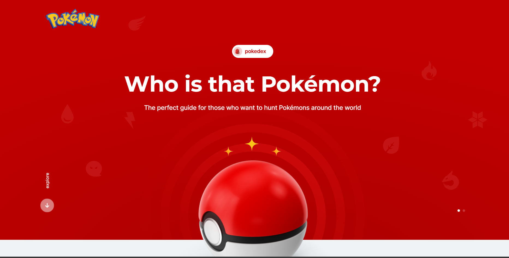

<h1 align="center"> React Native Insider - Receita Fácil </h1>

  

  
  
  

 

## 💻 Projeto

Pokédex é um projeto desenvolvido durante o curso [CodeBoost](https://codeboost.com.br/) O projeto consiste no consumo da PokéAPI onde estão listados todos os Pokémons já descobertos junto com seus status, a aplicação exibe todos, filtra os mostrinhos por tipo além de contar com a pesquisa por nome e ID dos mesmo.

## 🧪 Technologies

Esse projeto foi desenvolvido com as seguintes tecnolgias:

- [HTML](https://developer.mozilla.org/pt-BR/docs/Web/HTML)
- [SASS](https://sass-lang.com/)
- [JS](https://developer.mozilla.org/pt-BR/docs/Web/JavaScript)
- [Gulp](https://gulpjs.com/)
- [AXIOS](https://axios-http.com/)
- [PokeAPI](https://pokeapi.co/)

## 🌐 Acesso

Veja a aplicação online [AQUI](https://antdavi.github.io/pokedex-web/)

## 📝 License

Este projeto está licenciado sob a Licença MIT. Veja o arquivo [LICENSE](LICENSE) para obter mais detalhes.

---

Criado by Anthony Davi 🙃

